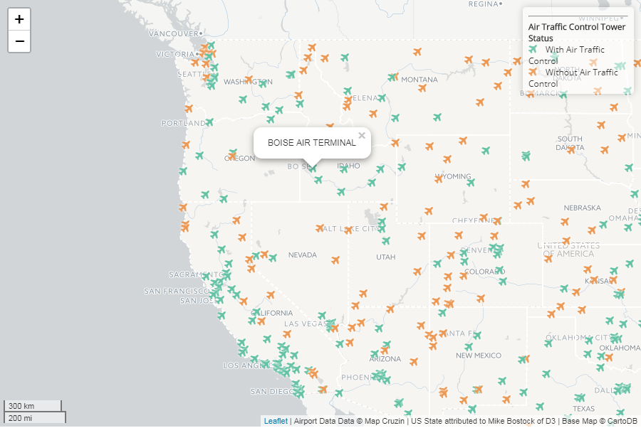

# Lab 3: Thematic Web Map Design

In this lab I was able to create a web map that not only showed all of the Airports in the united states but also was able to color code them based on their status as a air traffic control airport. Not only that but I also allowed that on the click of a specific airport the name of that airport would be displayed.

The State borders were taken from D3 however all other features of the map were unatributed 
